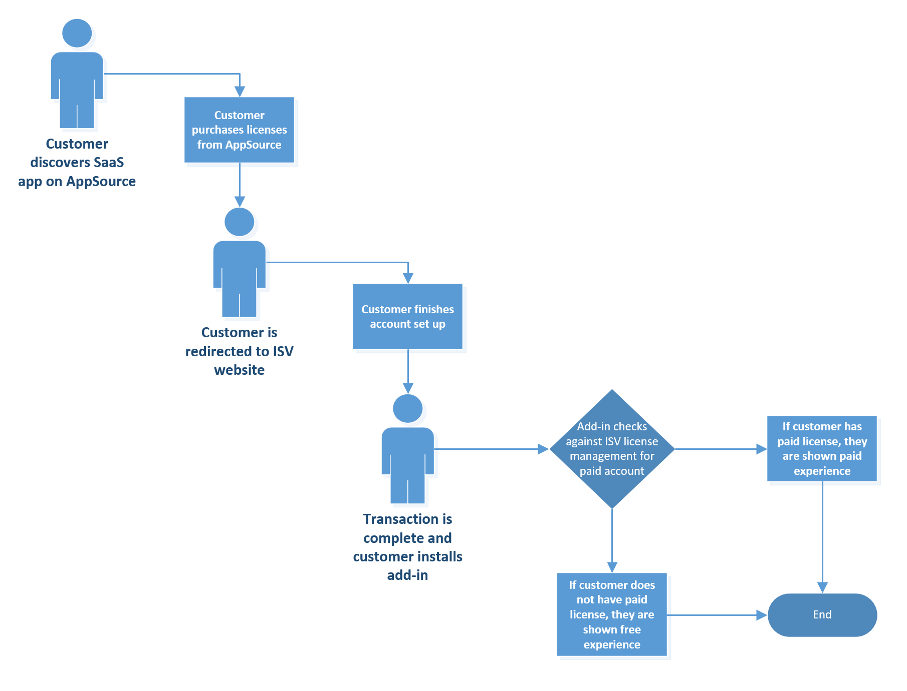

# Monetize your Office 365 add-in through Microsoft Commercial Marketplace

We’re making it easier for customers to discover bundled solutions and deploy them across Microsoft Teams, Office, SharePoint, and other Microsoft applications.

You can submit a single software-as-a-service (SaaS) application with connected add-ins, apps, and extensions and reach Microsoft customers through AppSource, in addition to selling your service through partners and through the Microsoft sales team. 

Monetize your add-in by using Partner Center to submit your service for purchase as a SaaS offer; for example, you can offer your service for a set price per user per month. For your customers, your add-in will be free to download, but will require a license to your service.

In this monetization model, your add-in is authenticated by your SaaS offering, which verifies its subscription status with the Microsoft SaaS service. Your responses from this service are used to update your user database. The following diagram shows this model.

**New monetization model**

<!--Write out steps for accessibility-->

## Preparing your SaaS offer
To prepare to submit your service as a SaaS offer, you will need to provide a website that a customer can sign in to and use to manage their purchased licenses. They can do this as either an admin user or an end user. Your service should be connected to your own licensing database that you can then use for your add-in to query.
To get started, see [Create new SaaS offer](https://docs.microsoft.com/azure/marketplace/partner-center-portal/create-new-saas-offer).

Your offer must also use the SaaS fulfillment APIs to integrate with Commercial Marketplace. For extensive documentation, see [SaaS fulfillment APIs](https://docs.microsoft.com/azure/marketplace/partner-center-portal/pc-saas-fulfillment-api-v2).

## Testing your SaaS offer

You can submit your SaaS offer as a private plan - this will make your offer private and visible only to the restricted audience of your choosing. After you test and get feedback, you can update the audience or choose to make the plan available to everyone. When a plan is published as visible to everyone, it must remain visible to everyone - you can't configure it to be a private plan again.

## Submission process for SaaS offer + add-in
You should submit your add-in first, with test accounts (admin + non-admin). After your add-in has been approved, you can then submit your SaaS offer. 

## Customer experience

A customer discovers your SaaS service in AppSource and purchases licenses, providing their payment detials to Microsoft. The customer is then redirected to your website, where they finish setting up their account. The licenses are provisioned and the customer is billed. Your customer is then able to download your free add-in and sign in using the details provided. Your add-in checks the licensing database to verify that the cusotmer has a license. The following illustration shows the user workflow.

## FAQs

### Why has Microsoft changed their monetization model for add-ins?

By charging for core application functionality and making add-ins free, partners gain more flexibility to add new value for customers by delivering paid functionality outside of the context of an add-in. To better support this model, AppSource has enabled full commerce for SaaS app transactions effective May 31, 2019, providing a new range of options for partners. Given our emphasis on a range of payment models for SaaS apps, we’re simplifying Office Add-ins by only supporting free-to-download options.

### How do I sign up for Partner Center?

Review the information on the [Welcome to Microsoft Partner Center](https://partner.microsoft.com/dashboard/account/v3/enrollment/introduction/azureisv) enrollment page and then register for an account. For details, see [Create a Commercial Marketplace account in Partner Center](https://docs.microsoft.com/azure/marketplace/partner-center-portal/create-account).

### Where can I find documentation about integrating with Azure Active Directory?

For extensive documentation, samples, and guidance, see [Microsoft identity platform overview](https://docs.microsoft.com/azure/active-directory/develop/v2-overview).
To start, we recommend that you have a subscription dedicated to your Azure Marketplace publishing, to isolate the work from other initiatives. Then you can start deploying your SaaS application in this subscription to start the development work.
You can also check for [Azure AD service updates](https://azure.microsoft.com/updates/?product=active-directory).

### How does my add-in authenticate a user with Azure AD?
Office provides the [Office Dialog API](https://docs.microsoft.com/en-us/office/dev/add-ins/develop/auth-with-office-dialog-api) to enable you to authenticate users from within your add-in. For more information, see [Microsoft identity platform](https://docs.microsoft.com/azure/active-directory/develop/v2-overview).

### What reports will I receive from Commercial Marketplace about my SaaS offer?

As a partner, you can monitor your offer listings using the data visualization and insight graphs supported by Partner Center and find ways to maximize your sales. The improved analytics tools enable you to act on performance results and maintain better relationships with your customers and resellers. For more information, see [Analytics for the Commercial Marketplace in Partner Center](https://docs.microsoft.com/azure/marketplace/partner-center-portal/analytics).

## Help and support

To kickstart your SaaS migration, or for any questions, contact [OVMC@microsoft.com](mailto:OVMC@microsoft.com). 

> [!NOTE] 
> Starting July 29th 2019, we will no longer accept new paid add-in submissions to AppSource. Customers will be able to purchase existing paid add-ins in AppSource until January 2020. They will then be hidden from the store, but will still be available for existing users. If these add-ins have not been migrated by July 2020, they will be removed from AppSource and for existing users. For details, see [Moving from paid to free add-ins](moving-from-paid-to-free-addins.md).

We will provide additional migration information in the near future.

