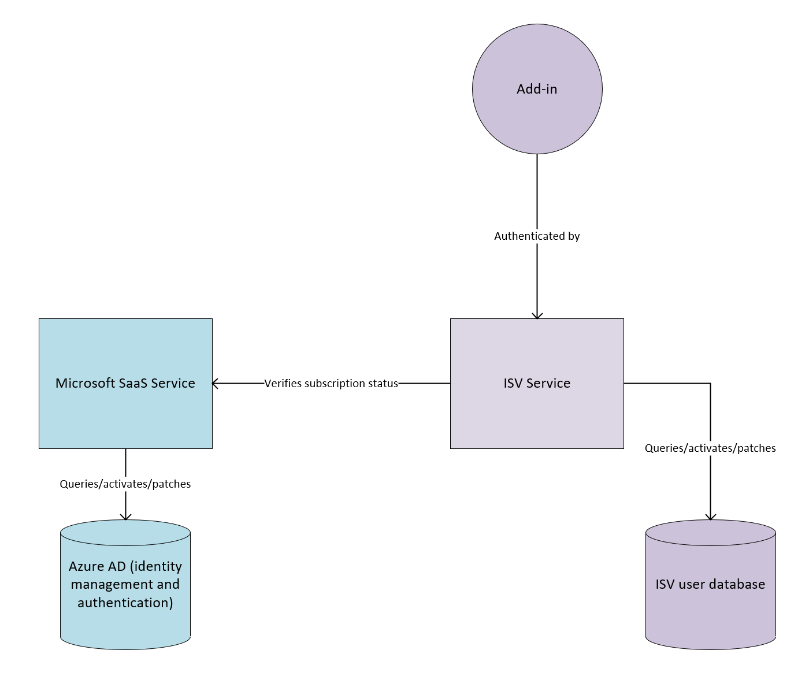
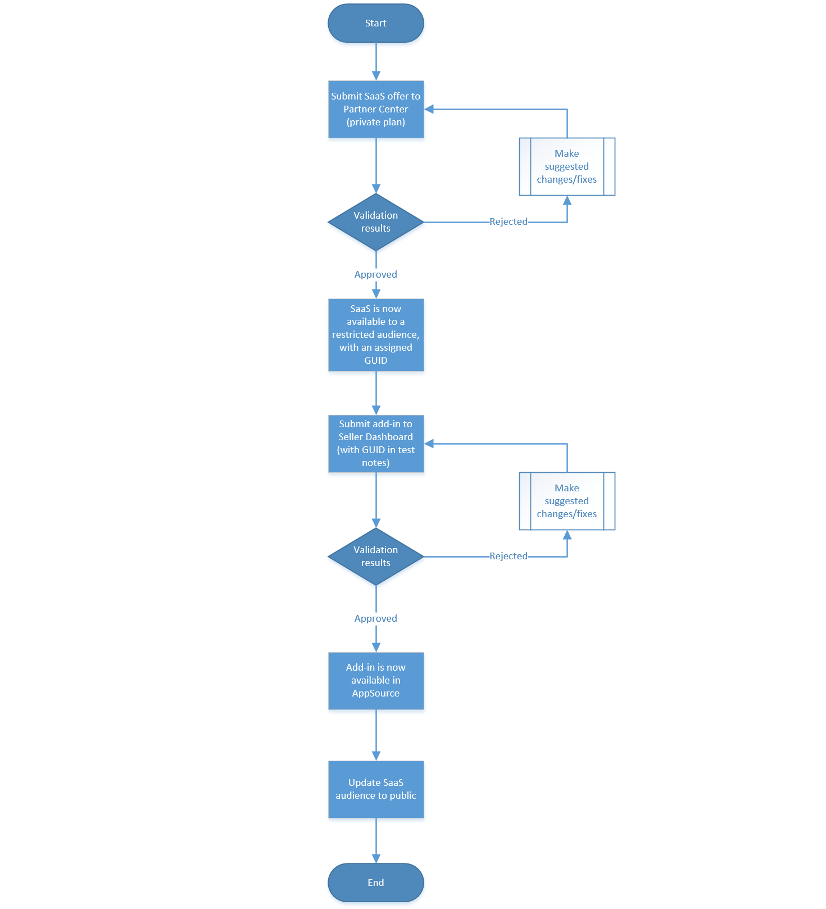

# Monetize your Office 365 add-in through Microsoft Commercial Marketplace

This article describes how to sell your add-in through Microsoft by using Partner Center to submit your service for purchase as a SaaS offer. Your add-in will be free for your customers to download, but will require a license to your service.

When you're ready to begin selling your service in Commercial Marketplace, we recommend that you submit a single software-as-a-service (SaaS) application with connected add-ins, apps, and extensions. You'll be able to reach Microsoft customers through Microsoft AppSource, in addition to selling your service through partners and through the Microsoft sales team.

We’re making it easier for customers to discover these Microsoft 365 app solutions, and deploy them across Microsoft Teams, Office, SharePoint, and other Microsoft applications.

In this monetization model, your add-in is authenticated by your SaaS offering, which verifies its subscription status with the Microsoft SaaS service. Your responses from this service are used to update your user database. The following diagram shows this model.

**New monetization model**

You are also free to monetize using your own payment model.

> [!NOTE] 
> Transactable SaaS apps are only purchasable using a work or school account. If you want to sell your add-in to Microsoft account-based users, you should consider implementing your own billing model.

## Preparing your SaaS offer
To prepare to submit your service as a SaaS offer, you will need to provide a website that a customer can sign in to and use to manage their purchased licenses. They can do this as either an admin user or an end user. Your service should be connected to your own licensing database that you can then use for your add-in to query.
To get started, see [Create new SaaS offer](https://docs.microsoft.com/azure/marketplace/partner-center-portal/create-new-saas-offer).

Your offer must also use the SaaS fulfillment APIs to integrate with Commercial Marketplace. For information, see [SaaS fulfillment APIs](https://docs.microsoft.com/azure/marketplace/partner-center-portal/pc-saas-fulfillment-api-v2).

### Sign up for Partner Center
To begin submitting your SaaS offer, you must create an account in the Commercial Marketplace program in Partner Center. This account must be associated with a company.
- If you're new to Partner Center, and have never enrolled in the Microsoft Partner Network, see [Create an account using the Partner Center enrollment page](https://docs.microsoft.com/azure/marketplace/partner-center-portal/create-account#create-an-account-using-the-partner-center-enrollment-page).
- If you're already enrolled in the Microsoft Partner Network or in a Partner Center developer program, see [Create an account using existing Microsoft Partner Center enrollments](https://docs.microsoft.com/azure/marketplace/partner-center-portal/create-account#create-an-account-using-existing-microsoft-partner-center-enrollments) for information about how to create your account.

### Register a SaaS application
You must register a SaaS application using the Microsoft Azure Portal. After a successful registration, you will receive an Azure Active Directory (Azure AD) security token that you can use to access the SaaS fulfillment APIs.
Any application that wants to use the capabilities of Azure AD must first be registered in an Azure AD tenant. This registration process involves giving Azure AD details about your application, such as the URL where it's located, the URL to send replies after a user is authenticated, the URI that identifies the app, and so on.

For details about how to register, see [Register an Azure AD-secured app](https://docs.microsoft.com/azure/marketplace/partner-center-portal/pc-saas-registration#register-an-azure-ad-secured-app).

### Create your licensing database
When monetizing through Commercial Marketplace SaaS, billing and transactions will be handled by Microsoft AppSource.  It is your responsiblity to handle license records and logic. Your SaaS should have a licensing database to keep track of all tenant purchases, and the users who have access.

Your metadata might include:
- Tenant ID
- Tenant Name
- Tenant Country
- Plan
- Licence type (seat-based or site-based)
- Number of licenses
- Admin name
- Admin email
- Assigned user IDs
- Assigned user emails

### Implement licensing management
Your service (website) must allow the admin who has made the purchase to sign in and manage the account. In the case where they have bought multiple seat-based licenses, they should be able to assign these to users within their organisation. 
You might want to consider the following types of licensing:
- Open licensing/first-come first-served - Any end-user who discovers your service can sign in to your service, be recognized as belonging to a tenant, and reserve one of the licenses purchased.
- Assigned licensing - The admin for the purchase must assign licenses to users.

Other considerations:
- Upsell - If a user tries to access your service, but their tenant has no more free licenses, you service could provide them with a temporary license, and use the opportunity to encourage the admin to purchase additional licenses.
- Multiple tenant purchases - You should consider whether to allow numerous purchases from the same tenant, and how to treat these in your database. For example, the Contoso Corporation sales team might purchase 50 licenses for their team, and the marketing team purchase 20 licenses for their team, and they might want to keep the account separate.

#### Connecting to Microsoft AppSource
At this point, you will have built a website and services capable of authenticating customers and handling their licensing state. In order to monetize through Microsoft (and receive confirmation of valid purchases), your service must use the [SaaS fulfilment APIs](https://docs.microsoft.com/azure/marketplace/partner-center-portal/pc-saas-fulfillment-api-v2) to connect to Microsoft AppSource, which uses these to drive the fulfilment, changes to plans, and cancellation of subscriptions.

#### Provisioning (customer purchase on Microsoft AppSource)
When a customer initiates a purchase, your service receives this information in an authorization code on a customer-interactive web page that uses a URL parameter; for example, `https://contoso.com/signup?token=..`, when the landing page URL in Partner Center is `https://contoso.com/signup`. The authorization code can be validated and exchanged for the details of the provisioning service by calling the resolve API. When a SaaS service finishes provisioning, it sends an activate call to signal that the fulfillment is complete and the customer can be billed.

The following diagram shows the sequence of API calls for a provisioning scenario.

#### Marketplace initiated update

When a customer initiates an update on Microsoft AppSource, Microsoft AppSource notifies the webhook implemented by your service, which then queries Microsoft AppSource for an update, and then the customer is charged or refunded.

The following diagram shows the sequence of actions when an update is initiated from the marketplace.

#### Service initiated update

When a customer initiates an update on your service (if you allow this action), your service should update the subscription held by Microsoft AppSource, which in turn will trigger a notification from Microsoft AppSource to the webhook you have implemented. At this point, the actual changes to your licensing database should be made.

The following diagram shows the actions when an update is initiated from your SaaS service.

 

For more details, see [SaaS fufillment APIs](https://docs.microsoft.com/azure/marketplace/partner-center-portal/pc-saas-fulfillment-api-v2) reference.

### Build an Azure AD connected add-in
Your add-in will rely on your service to verify whether the user accessing the add-in has a license associated with their account. It is up to you to whether you give them a free (but limited) experience or whether you simply direct them to where to purchase licenses.
Your add-in should have three states:
1.	User not signed in
2.	User signed in, no license associated
3.	User signed in, license associated

For information about authenticating with Azure AD, see [Authorize to Microsoft Graph](https://docs.microsoft.com/office/dev/add-ins/develop/authorize-to-microsoft-graph-without-sso).

### Code sample: Move from paid add-ins to paid web apps with free add-ins

> [!VIDEO https://www.youtube.com/watch?v=lnn-X4QfdXU&feature=youtu.be]

The [Office Add-in SaaS monetization code sample](https://github.com/OfficeDev/office-add-in-saas-monetization-sample) demonstrates how you can create a simple license management system to manage add-ins sold in Microsoft AppSource. This code sample package includes a Microsoft AppSource mock web app, a SaaS sample, a SharePoint add-in, an Outlook add-in, and a licensing management tool.

## Submission process for SaaS offer + add-in
Submit your SaaS offer to Partner Center. After your SaaS offer is approved, it will be assigned a GUID. Next, submit your add-in and include this GUID in the test notes, as well as test accounts (admin + non-admin). After your add-in has been approved and is in the store, you can update your plan to be available to a public audience.

## Customer experience

A customer discovers your SaaS service in Microsoft AppSource and purchases licenses, providing their payment details to Microsoft. The customer is then redirected to your website, where they finish setting up their account. The licenses are provisioned and the customer is billed. Your customer is then able to download your free add-in and sign in using the details provided. Your add-in checks the licensing database to verify that the cusotmer has a license. 

## FAQs

### Why has Microsoft changed their monetization model for add-ins?

By charging for core application functionality and making add-ins free, partners gain more flexibility to add new value for customers by delivering paid functionality outside of the context of an add-in. To better support this model, Microsoft AppSource has enabled full commerce for SaaS app transactions effective May 31, 2019, providing a new range of options for partners. Given our emphasis on a range of payment models for SaaS apps, we’re simplifying Office Add-ins by only supporting free-to-download options.

### How do I sign up for Partner Center?

Review the information on the [Welcome to Microsoft Partner Center](https://partner.microsoft.com/dashboard/account/v3/enrollment/introduction/azureisv) enrollment page and then register for an account. For details, see [Create a Commercial Marketplace account in Partner Center](https://docs.microsoft.com/azure/marketplace/partner-center-portal/create-account).

### Where can I find documentation about integrating with Azure Active Directory?

For extensive documentation, samples, and guidance, see [Microsoft identity platform overview](https://docs.microsoft.com/azure/active-directory/develop/v2-overview).
To start, we recommend that you have a subscription dedicated to your Azure Marketplace publishing, to isolate the work from other initiatives. Then you can start deploying your SaaS application in this subscription to start the development work.
You can also check for [Azure AD service updates](https://azure.microsoft.com/updates/?product=active-directory).

### How does my add-in authenticate a user with Azure AD?
Office provides the [Office Dialog API](https://docs.microsoft.com/office/dev/add-ins/develop/auth-with-office-dialog-api) to enable you to authenticate users from within your add-in. For more information, see [Microsoft identity platform](https://docs.microsoft.com/azure/active-directory/develop/v2-overview).

### What reports will I receive from Commercial Marketplace about my SaaS offer?

As a partner, you can monitor your offer listings using the data visualization and insight graphs supported by Partner Center and find ways to maximize your sales. The improved analytics tools enable you to act on performance results and maintain better relationships with your customers and resellers. For more information, see [Analytics for the Commercial Marketplace in Partner Center](https://docs.microsoft.com/azure/marketplace/partner-center-portal/analytics).

## Help and support

For any questions, contact [Marketplace Publisher Support](https://aka.ms/marketplacepublishersupport). 

> [!NOTE] 
> Starting July 29th 2019, we will no longer accept new paid add-in submissions to Microsoft AppSource. Customers will be able to purchase existing paid add-ins in Microsoft AppSource until January 2020. They will then be hidden from the store, but will still be available for existing users. If these add-ins have not been migrated by July 2020, they will be removed from Microsoft AppSource and for existing users. For details, see [Moving from paid to free add-ins](moving-from-paid-to-free-addins.md).

We will provide additional migration information in the near future.

